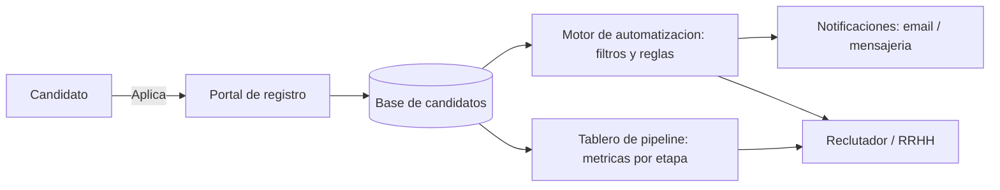

# Reclutalia — Caso de estudio

Plataforma digital de **reclutamiento con automatización de procesos**.
Rol de Ernesto: Desarrollo / Liderazgo de Producto · Grupo Salinas / UPAX (2021–2023).

**Español** · [English](#english)

> Caso de estudio (documentación de producto). No contiene código de producción; muestra la visión
> de producto, las decisiones y los resultados del proyecto.

---

## El problema

Los procesos de reclutamiento masivo eran manuales, lentos y poco trazables: captura repetitiva de
candidatos, seguimiento en hojas de cálculo, comunicación dispersa y baja visibilidad del *pipeline*.
El resultado eran tiempos de contratación largos, fuga de candidatos y nula medición del embudo.

## La solución

**Reclutalia**, una plataforma que digitaliza y automatiza el ciclo de reclutamiento de punta a punta:

- Captura y registro de candidatos centralizado.
- Automatización de etapas del embudo (filtros, notificaciones, recordatorios).
- Tablero de seguimiento del *pipeline* con métricas por etapa.
- Comunicación automatizada con candidatos en momentos clave.

## Arquitectura (conceptual)

## Mi rol y decisiones de producto

- **Definición del producto:** alcance, prioridades y *roadmap* alineado a objetivos de negocio.
- **Ciclo de vida:** de la conceptualización a la implementación y evolución.
- **Go-to-Market:** estrategia de lanzamiento y adopción.
- **Automatización:** identificación de los flujos de mayor impacto para automatizar primero.
- **Metodología ágil:** entregas iterativas para validar valor temprano.

## Resultados (impacto)

- Reducción del tiempo de captura y seguimiento gracias a la automatización del embudo.
- Visibilidad del *pipeline* en tiempo real para el equipo de reclutamiento.
- Menor fuga de candidatos por la comunicación automatizada y oportuna.

> Las métricas específicas se documentan de forma cualitativa para respetar la confidencialidad del proyecto.

## Disciplinas aplicadas

Product Management · Go-to-Market · Automatización de procesos · Scrum · UX / Customer Journey · KPIs de embudo.

## Aprendizajes

- Priorizar la automatización donde hay volumen y repetición maximiza el ROI inicial.
- La trazabilidad del embudo convierte el reclutamiento en un proceso medible y mejorable.

---

## English

> Case study (product documentation), not production code.

**The problem:** high-volume recruitment was manual, slow and hard to track — repetitive candidate entry,
spreadsheet follow-up, scattered communication and no funnel visibility — leading to long hiring times and drop-off.

**The solution:** Reclutalia digitizes and automates the end-to-end recruitment cycle: centralized candidate
capture, funnel automation (filters, notifications, reminders), a pipeline dashboard with per-stage metrics,
and automated candidate communication at key moments.

**My role:** product definition and roadmap, full product lifecycle, Go-to-Market, and selecting the
highest-impact flows to automate first — delivered with agile iterations.

**Outcomes:** faster capture and follow-up, real-time pipeline visibility, and reduced drop-off through timely
automated communication. *(Specific metrics described qualitatively for confidentiality.)*

**Disciplines:** Product Management · Go-to-Market · Process Automation · Scrum · UX / Customer Journey · Funnel KPIs.
