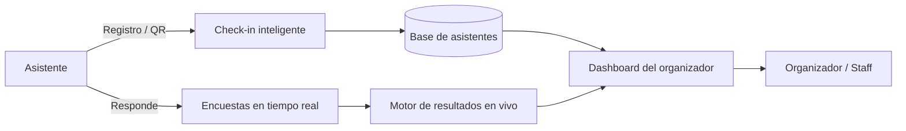

# ZEUS Eventos — Caso de estudio

Plataforma de **gestión de eventos con registro inteligente y encuestas en tiempo real**.
Rol de Ernesto: Desarrollo / Liderazgo de Producto · Grupo Salinas / UPAX (2021–2023).

**Español** · [English](#english)

> Caso de estudio (documentación de producto). No contiene código de producción; muestra la visión
> de producto, las decisiones y los resultados del proyecto.

---

## El problema

La operación de eventos presenciales sufría cuellos de botella en el registro (filas largas, captura
manual, acreditaciones lentas) y poca retroalimentación: las encuestas llegaban tarde o nunca, sin
datos accionables durante el evento.

## La solución

**ZEUS Eventos**, una plataforma que digitaliza la experiencia del asistente y la operación del organizador:

- Registro inteligente y acreditación rápida (check-in ágil).
- Encuestas en tiempo real para medir satisfacción y captar feedback durante el evento.
- Tablero del organizador con asistencia y resultados en vivo.
- Comunicación con asistentes (confirmaciones, recordatorios, avisos).

## Arquitectura (conceptual)

## Mi rol y decisiones de producto

- **Definición del producto** y *roadmap* enfocado en eliminar la fricción del registro.
- **Experiencia del asistente:** check-in rápido como prioridad número uno.
- **Feedback en vivo:** encuestas en tiempo real para decisiones durante el evento, no después.
- **Go-to-Market** y estrategia de adopción para organizadores.
- **Metodología ágil** con entregas iterativas.

## Resultados (impacto)

- Registro y acreditación más rápidos: menos filas y mejor experiencia del asistente.
- Retroalimentación accionable en tiempo real para el organizador.
- Operación de eventos más medible y repetible.

> Las métricas específicas se documentan de forma cualitativa para respetar la confidencialidad del proyecto.

## Disciplinas aplicadas

Product Management · Go-to-Market · Eventos / Real-time · Scrum · UX / Customer Journey · Analítica en vivo.

## Aprendizajes

- Atacar primero el punto de mayor fricción (el registro) genera el mayor impacto percibido.
- El feedback en tiempo real cambia decisiones durante el evento, no solo en el post-mortem.

---

## English

> Case study (product documentation), not production code.

**The problem:** in-person events suffered registration bottlenecks (long lines, manual entry, slow
accreditation) and poor feedback loops — surveys arrived late or never, with no actionable data during the event.

**The solution:** ZEUS Eventos digitizes the attendee experience and the organizer's operation: smart
registration and fast check-in, real-time surveys, a live organizer dashboard, and attendee communications.

**My role:** product definition and roadmap focused on removing registration friction, prioritizing fast
check-in, enabling live feedback for in-event decisions, plus Go-to-Market — delivered with agile iterations.

**Outcomes:** faster check-in (shorter lines, better experience), actionable real-time feedback for organizers,
and a more measurable, repeatable event operation. *(Specific metrics described qualitatively for confidentiality.)*

**Disciplines:** Product Management · Go-to-Market · Real-time Events · Scrum · UX / Customer Journey · Live Analytics.
